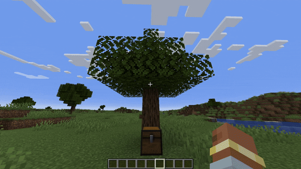
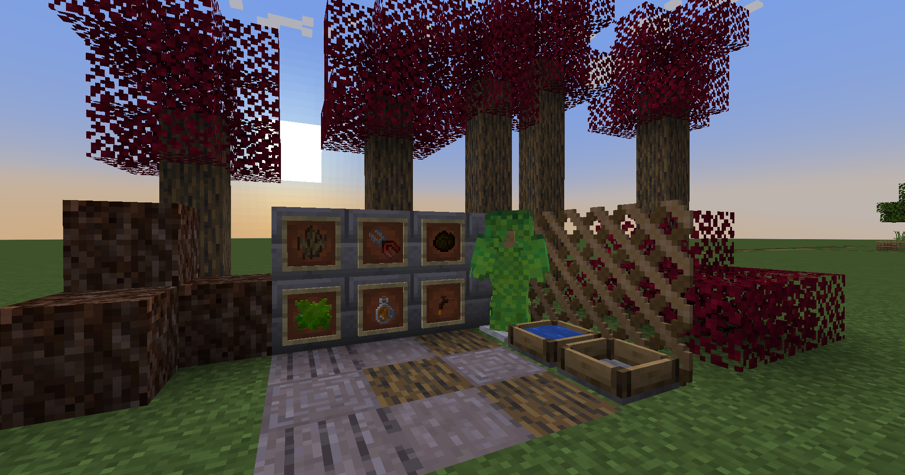

    
# 🌳Garden Expansion🌳 
[](https://legacy.curseforge.com/minecraft/mc-mods/garden-expansion)


Modyfikacja do gry Minecraft dodajaca troche nowej funkcjonalnosci 


## Autorzy

- [@Keameleek](https://github.com/Trzmi3l) - Kamil Marzenowski
- [@vinamon](https://github.com/vinamon) - Marceli Denysiuk

## Co dodane

- Garść liści
- Zestaw zbroi z liści, który przy pełnym założeniu daje Szczęście 2
- Całkowicie nowe drewno i drzewa - Klon
- Obornik
- Blok błota
- Sekator
- Kora
- Syrop klonowy
- Kranik do pozyskiwania syropu klonowego
- Zbieracz wody deszczowej
- Kratka do roślin pnących
- Osobna karta w menu kreatywnym dla przedmiotów z modyfikacji

## Użyte biblioteki, programy i dokumentacje

- OwoLib: [Dokumentacja](https://docs.wispforest.io/), [GitHub](https://github.com/wisp-forest/owo-lib)
- GeckoLib: [GitHub](https://github.com/bernie-g/geckolib), [Wiki](https://github.com/bernie-g/geckolib/wiki)
- Blockbench [Blockbench](https://www.blockbench.net/)

## Wymagania

- Minecraft 1.20.4 z Fabric Loaderem [FabricMC](https://fabricmc.net/)
- Fabric API: [Pobierz z CurseForge](https://www.curseforge.com/minecraft/mc-mods/fabric-api/files/5045131)
- Owo Lib: [Pobierz z CurseForge](https://www.curseforge.com/minecraft/mc-mods/owo-lib/files/5043211)
- GeckoLib: [Pobierz z CurseForge](https://www.curseforge.com/minecraft/mc-mods/geckolib/files/5188390)

## Usprawnienia w procesie tworzenia

### Rejestracja przedmiotów i bloków

Optymalizacja rejestracji przy użyciu biblioteki OwoLib znacząco skraca proces rejestracji poprzez prostą konfigurację.

Przykład rejestracji przy użyciu OwoLib:
```Java
public class RegisterBlocks implements BlockRegistryContainer {

    public static final Block BARK_BLOCK = new BarkBlock();

    @Override
    public BlockItem createBlockItem(Block block, String identifier) {
        return new BlockItem(block, new OwoItemSettings().group(GardenExpansion.ITEM_GROUP));
    }
}
```
Oszczędzamy pisanie kolejnych linijek kodu i manualnego wstukiwania contentu do rejestrów, minimalizujemy ryzyko wystepowania potencjalnytch błędów i usprawniamy pracę, rejestrując każdy blok i przedmiot, który chcemy dodać praktycznie w jednej linijce kodu. Więcej o rejestracji przy uzyciu [tutaj <- link do dokumentacji OwoLib](https://docs.wispforest.io/owo/registration/). Używając OwoLib, dodajemy takżę za jednym zamachem wszystko do zakładki w menu kreatywnym.

### Generowanie danych

Generowanie danych takich jak tagi, tabele dropów, modele, blockstates i craftingi zamiast pisania ich ręcznie daje możliwość tworzenia masowej ilości danych JSON, które są potrzebne do prawidłowego działania bloku/przedmiotu.

Wszystkie klasy generujące znajdują się [tutaj <- odnosnik do lokalizacji w repozytorium](https://github.com/Trzmi3l/Fabric-mod-Garden-Expansion/tree/Master/src/main/java/com/gardenexpansion/datagen).

### Nadawanie koloru bloku liści klonu

Kolor liści nadawany jest przez [ColorProvider](https://fabricmc.net/wiki/tutorial:colorprovider) zamiast przez osobną teksturę.

Dla bloku:
```Java
ColorProviderRegistry.BLOCK.register((state, world, pos, tintIndex) -> {
    if (world == null || pos == null) {
        return colorProvider.getColor(state, world, pos, tintIndex);
    }
    return colorProvider.getColor(state, world, pos, tintIndex);
}), RegisterBlocks.MAPLE_LEAVES;
```
Dla itemu:
```Java
ColorProviderRegistry.ITEM.register((stack, tintIndex) -> {
    return colorProvider.getColor();
}, RegisterBlocks.MAPLE_LEAVES.asItem());
```
```Java
@Override
    public int getColor(BlockState state, @Nullable BlockRenderView world, @Nullable BlockPos pos, int tintIndex) {
            return 0xDC143C;
    }
```
Metoda getColor zwraca int i nadaje kolor liściom. Metoda nadawania koloru w ten sposób umożliwia zmianę koloru zmieniając tylko jedną wartość w kodzie, dzięki czemu nie trzeba wielokrotnie tworzyć tekstur dla jednego bloku/przedmiotu.

## Graficzne przedstawienie dodanych funkcji

- Zbroja z trawy

   

- Zebranie garści liści sekatorem

   

- Zebranie kory poprzez okorowanie drzewa

   

- Pozyskiwanie i użycie obornika

   


- Użycie kranika do zbierania syropu

   

- Zestawienie wszystkich funkcji

   

  
## Lokalne uruchamianie

  Clone project

```bash
git clone https://github.com/Trzmi3l/Fabric-mod-Garden-Expansion
```

   Open IDE and import existing Gradle project

   Run gradle tasks:
   ```
   > Tasks > build > build
   ```

   For starting minecraft run:
   ```
   > Tasks > fabric > runClient
   ```

## TODO

- Naturalny spawn drzew klonu
- Poprawienie zbugowanego water collectora

## Skąd czerpaliśmy wiedzę

- [FabricMC Tutorial](https://fabricmc.net/wiki/tutorial:start#creating_your_first_mod)
- [YouTube FabricMC Tutorial Series](https://www.youtube.com/watch?v=0Pr_iHlVKsI&list=PLKGarocXCE1EO43Dlf5JGh7Yk-kRAXUEJ)
- [Maven FabricMC Documentation](https://maven.fabricmc.net/docs/yarn-1.20-pre4+build.3/allclasses-index.html)
- [Fabric Tutorial GitHub](https://github.com/Tutorials-By-Kaupenjoe/Fabric-Tutorial-1.20.X/tree/main)
- Chat GPT
- Google Gemini


## Dopisek końcowy
Celem robienia tego moda było po prostu nauczenie się, o co chodzi z Fabric API i jak tworzy sie modyfikacje do mc. Podczas robienia projektu staralismy się ogarnąć każdy kawałek api i dodawania nowych rzeczy. Oczywiscie nie udało się zrobić wszystkiego, ale większość ważnych rzeczy, zarówno tych trudnych, jak i łatwiejszych, udało nam się ogarnąć. Do zredagowania readme i poprawek po mnie (kamilu hehe) uzylismy chata gpt :33

